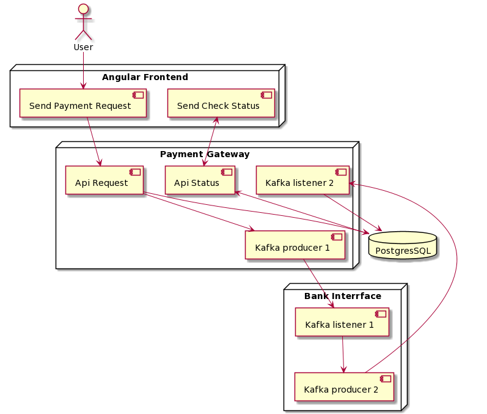

## PAYMENT ASYNC SCENARIO

## Flow
1. User create payment request using **payment page**
2. * **payment page** will send request payment to **payment gateway - _api request_**
   * **payment page** will send request to **payment gateway - _api status_** for check status transaction
4. **payment gateway - _api request_** init transaction data to database
5. **payment gateway - _api request_** send kafka to **bank interface**
6. **bank interface** will give response to **payment gateway** using kafka
7. **payment gateway** update transaction by response from **bank interface**  

## How to run this project
1. `cd payment-page`
2. `ng serve`

